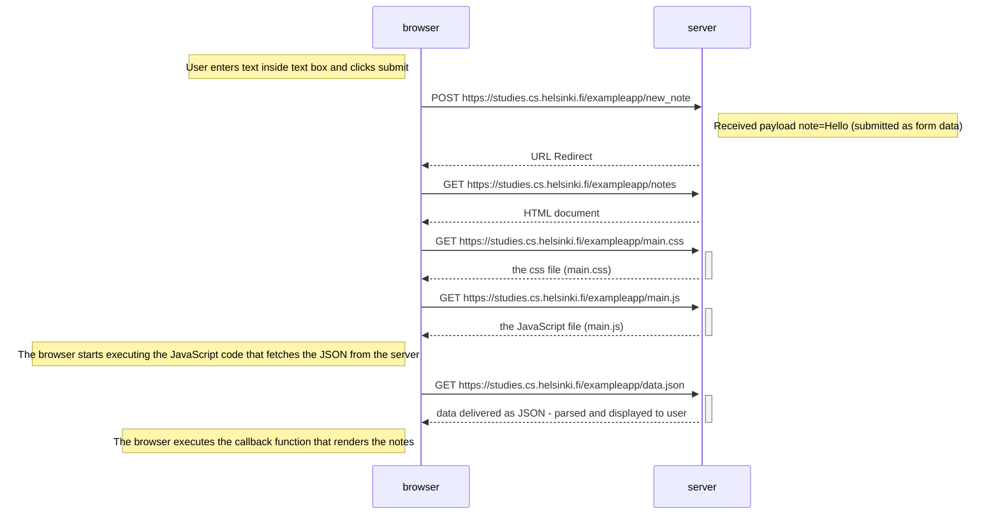

```mermaid
sequenceDiagram
    participant browser
    participant server

    Note left of browser: User enters text inside text box and clicks submit

    browser->>server: POST https://studies.cs.helsinki.fi/exampleapp/new_note
    Note right of server: Received payload note=Hello (submitted as form data)
    activate server
    server-->>browser: URL Redirect

    browser->>server: GET https://studies.cs.helsinki.fi/exampleapp/notes
    activate server
    server-->>browser: HTML document

    browser->>server: GET https://studies.cs.helsinki.fi/exampleapp/main.css
    activate server
    server-->>browser: the css file (main.css)
    deactivate server

    browser->>server: GET https://studies.cs.helsinki.fi/exampleapp/main.js
    activate server
    server-->>browser: the JavaScript file (main.js)
    deactivate server

    Note left of browser: The browser starts executing the JavaScript code that fetches the JSON from the server

    browser->>server: GET https://studies.cs.helsinki.fi/exampleapp/data.json
    activate server
    server-->>browser: data delivered as JSON - parsed and displayed to user
    deactivate server

    Note left of browser: The browser executes the callback function that renders the notes
```