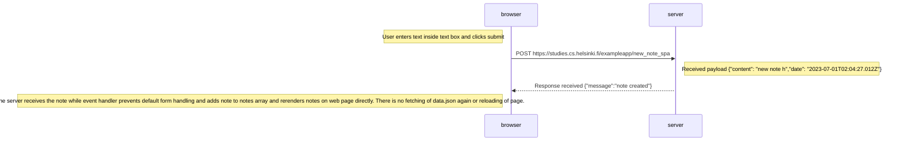

```mermaid
sequenceDiagram
    participant browser
    participant server

    Note left of browser: User enters text inside text box and clicks submit

    browser->>server: POST https://studies.cs.helsinki.fi/exampleapp/new_note_spa 
    Note right of server: Received payload {"content": "new note h","date": "2023-07-01T02:04:27.012Z"}
    activate server
    server-->>browser: Response received {"message":"note created"}

    Note left of browser: The server receives the note while event handler prevents default form handling and adds note to notes array and rerenders notes on web page directly. There is no fetching of data.json again or reloading of page.
```